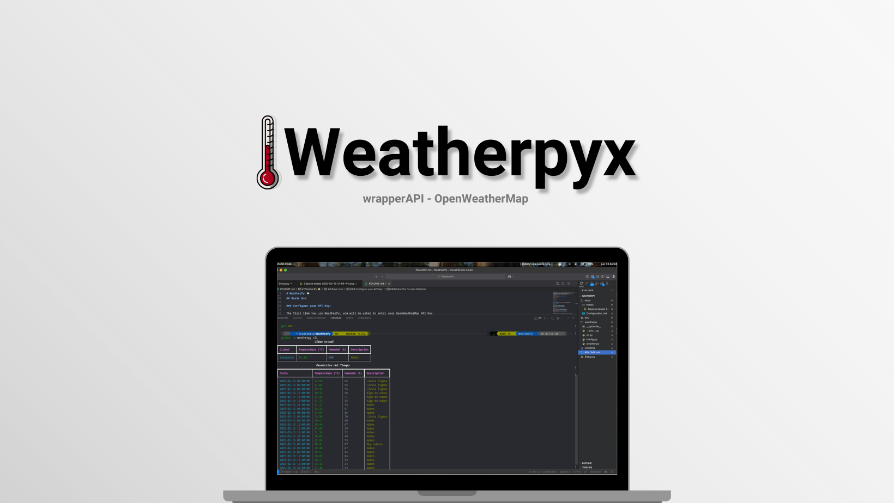

WeatherPyx is an elegant and simple wrapper for the OpenWeatherMap API that allows you to obtain weather data quickly and easily. Designed to be intuitive for both CLI use and integration into Python projects.

## ⚡ Features

- 🎨 Elegant CLI interface using Rich
- 🔑 Automatic API key management
- 📊 Attractive display of weather data
- 🌍 Support for current weather and 5-day forecasts
- 🐍 Easy integration into Python code
- 📱 Location auto-detection (with optional module)

**Threads:** [Visit my profile on Threads](https://www.threads.net/@augusst_morales?hl=es-la)s